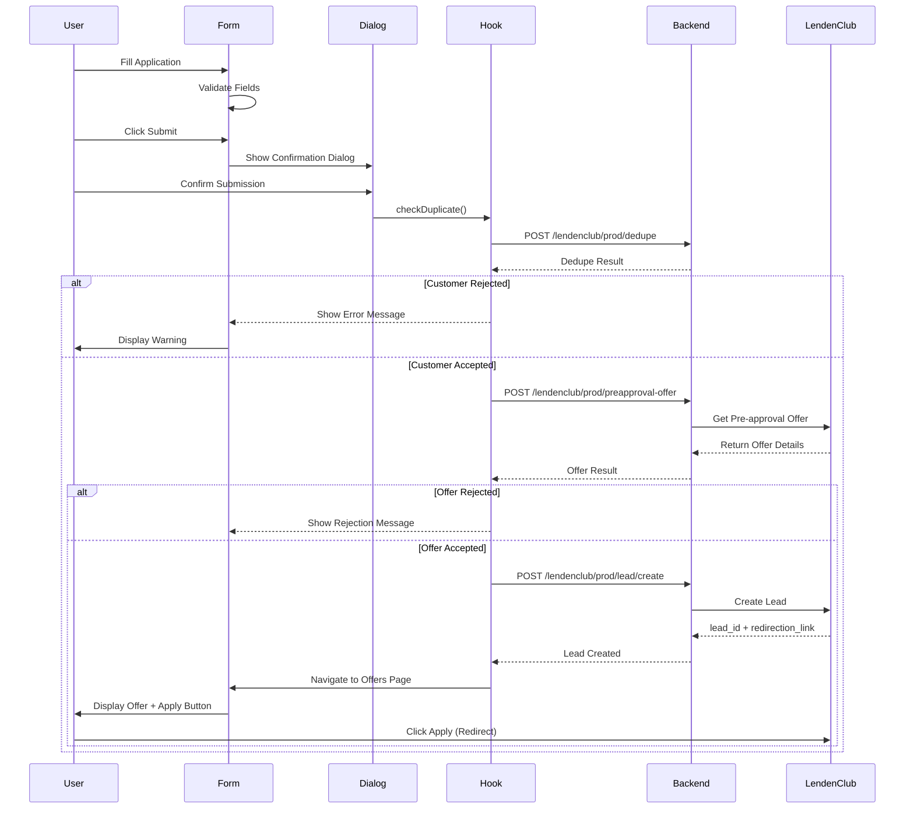

# LendenClub API Integration Replication Guide

> **Purpose**: Complete guide to replicate the LendenClub API integration from Customer Portal to Partner Portal  
> **Last Updated**: January 18, 2026  
> **Integration Type**: Vartis Glide 2.0 API

---

## Table of Contents

1. [Architecture Overview](#architecture-overview)
2. [Core Components](#core-components)
3. [Data Flow](#data-flow)
    - [Complete Multi-Step Flow](#complete-application-submission-flow)
    - [UI Flow with Confirmation Dialog](#ui-flow-with-confirmation-dialog)
4. [Implementation Steps](#implementation-steps)
    - [Confirmation Dialog](#step-5-implement-confirmation-dialog)
    - [Complete Multi-Step Flow](#step-6-implement-complete-multi-step-flow)
    - [Offers Page](#step-7-implement-offers-page)
5. [Code Examples](#code-examples)
6. [Testing Checklist](#testing-checklist)

---

## Architecture Overview

### Integration Flow Diagram

```
┌─────────────────┐
│  User Form      │
│  (Multi-step)   │
└────────┬────────┘
         │
         ▼
┌─────────────────┐
│  useLendenClub  │  ← Custom Hook (Business Logic)
│  Hook           │
└────────┬────────┘
         │
         ▼
┌─────────────────┐
│  lendenclub.js  │  ← API Service Layer
│  Service        │
└────────┬────────┘
         │
         ▼
┌─────────────────┐
│  axiosConfig.js │  ← HTTP Client
│  (Auth +        │
│   Interceptors) │
└────────┬────────┘
         │
         ▼
┌─────────────────┐
│  Backend API    │
│  /lendenclub/   │
│  prod/*         │
└─────────────────┘
```

### Key Integration Points

1. **API Endpoints**: 5 main endpoints for dedupe, offer, lead creation, status, and link generation
2. **Consent Management**: Device ID + IP + Geolocation + Consent text
3. **Nested Payload Structure**: 6 main sections (basic, address, professional, loan, consent, bureau)
4. **Validation Layer**: Frontend validation before backend submission
5. **Error Handling**: Structured error responses with validation errors

---

## Core Components

### 1. Custom Hook: `useLendenClub.js`

**Location**: `src/hooks/useLendenClub.js`

**Purpose**: Centralizes all LendenClub operations with loading/error state management

**Key Methods**:

```javascript
const {
    loading, // Boolean: API call in progress
    error, // String: Error message if any
    submitLoan, // Function: Submit loan application
    checkDuplicate, // Function: Check if customer exists
    getOffer, // Function: Get pre-approval offer
    getStatus, // Function: Check lead status
    getNewLink, // Function: Get fresh redirection link
} = useLendenClub();
```

**Usage Example**:

```javascript
import { useLendenClub } from '&/hooks/useLendenClub';

function LoanApplicationForm() {
    const { submitLoan, loading, error } = useLendenClub();

    const handleSubmit = async (formData) => {
        const result = await submitLoan(
            formData,
            // Success callback
            (data) => {
                console.log('Lead created:', data.leadId);
                window.location.href = data.redirectionLink;
            },
            // Error callback
            (error) => {
                if (error.isValidationError) {
                    console.error('Validation errors:', error.validationErrors);
                }
            }
        );
    };

    return (
        // Your form JSX
    );
}
```

---

### 2. API Service Layer: `lendenclub.js`

**Location**: `src/services/lendenclub.js`

**Purpose**: Low-level API calls to backend endpoints

**Constants**:

```javascript
const LENDENCLUB_ENTITY_ID = 'RRSPO'; // Your regulated entity ID
```

**API Endpoints**:

| Method                  | Endpoint                              | Purpose                  |
| ----------------------- | ------------------------------------- | ------------------------ |
| `dedupeCheck()`         | `lendenclub/prod/dedupe`              | Check if customer exists |
| `getPreapprovalOffer()` | `lendenclub/prod/preapproval-offer`   | Get loan offer           |
| `createLead()`          | `lendenclub/prod/lead/create`         | Submit application       |
| `getLeadDetail()`       | `lendenclub/prod/lead/detail`         | Get redirection link     |
| `checkLeadStatus()`     | `lendenclub/prod/lead/status/:leadId` | Check application status |

**Complete Implementation**:

```javascript
// src/services/lendenclub.js
import { coreApi } from './axiosConfig';
import { handleResponse } from './common';

const LENDENCLUB_ENTITY_ID = 'RRSPO';

export const dedupeCheck = (mobileNumber, pan, email) => {
    const response = coreApi.makeAuthenticatedPostCall(
        'lendenclub/prod/dedupe',
        {
            payload: {
                mobile_number: mobileNumber,
                pan: pan,
                email: email,
                regulated_entity_id: LENDENCLUB_ENTITY_ID,
            },
        },
    );
    return handleResponse(response);
};

export const getPreapprovalOffer = payload => {
    const payloadWithEntity = {
        ...payload,
        regulated_entity_id: LENDENCLUB_ENTITY_ID,
    };
    const response = coreApi.makeAuthenticatedPostCall(
        'lendenclub/prod/preapproval-offer',
        { payload: payloadWithEntity },
    );
    return handleResponse(response);
};

export const createLead = payload => {
    const payloadWithEntity = {
        ...payload,
        regulated_entity_id: LENDENCLUB_ENTITY_ID,
    };
    const response = coreApi.makeAuthenticatedPostCall(
        'lendenclub/prod/lead/create',
        { payload: payloadWithEntity },
    );
    return handleResponse(response);
};

export const getLeadDetail = (leadId, redirectionUrl) => {
    const response = coreApi.makeAuthenticatedPostCall(
        'lendenclub/prod/lead/detail',
        {
            payload: {
                lead_id: leadId,
                redirection_url: redirectionUrl,
                regulated_entity_id: LENDENCLUB_ENTITY_ID,
            },
        },
    );
    return handleResponse(response);
};

export const checkLeadStatus = leadId => {
    const response = coreApi.makeAuthenticatedGetCall(
        `lendenclub/prod/lead/status/${leadId}?regulated_entity_id=${LENDENCLUB_ENTITY_ID}`,
    );
    return handleResponse(response);
};
```

---

### 3. Consent Helper: `consentHelper.js`

**Location**: `src/helpers/consentHelper.js`

**Purpose**: Generate consent data with device ID, IP, and geolocation

**Key Functions**:

```javascript
// Get or generate persistent device ID
export const getDeviceId = () => {
    const storageKey = 'lendenclub_device_id';
    let deviceId = localStorage.getItem(storageKey);

    if (!deviceId) {
        deviceId = `DEV_${Date.now()}_${Math.random().toString(36).substring(2, 15)}`;
        localStorage.setItem(storageKey, deviceId);
    }

    return deviceId;
};

// Get user's IP (backend should override with actual IP)
export const getClientIP = () => {
    return '0.0.0.0'; // Placeholder - backend populates actual IP
};

// Get geolocation coordinates (async)
export const getGeolocation = () => {
    return new Promise(resolve => {
        if (navigator.geolocation) {
            navigator.geolocation.getCurrentPosition(
                position => {
                    resolve({
                        latitude: position.coords.latitude.toString(),
                        longitude: position.coords.longitude.toString(),
                    });
                },
                error => {
                    console.warn('Geolocation not available:', error.message);
                    resolve({ latitude: '0.0', longitude: '0.0' });
                },
                { timeout: 5000 },
            );
        } else {
            resolve({ latitude: '0.0', longitude: '0.0' });
        }
    });
};

// Generate complete consent data array
export const generateConsentData = async () => {
    const deviceId = getDeviceId();
    const ipAddress = getClientIP();
    const location = await getGeolocation();

    const bureauConsentContent = `I hereby give my consent to Varthana Finance Private Limited 
and its assigns and successors and its authorized representatives to access the credit 
information of mine as is available with credit information company (CIBIL/Equifax/Experian/CRIF 
High Mark) now and anytime in future for the purpose of accessing my eligibility for availing 
Personal Loan from Varthana Finance Private Limited, which I will be applying. I also hereby 
authorise Varthana Finance Private Limited to share my contact and credit information with 
affiliates, group companies, service providers and any other third party for related purposes 
mentioned above.`;

    const loginConsentContent = `I hereby authorize LendenClub and its affiliates to use my 
contact details and personal information for the purpose of processing my loan application 
and providing related services. I agree to receive communications via phone, SMS, email, 
and WhatsApp regarding my application and loan account.`;

    return [
        {
            consent_type: 'bureau_consent',
            ip_address: ipAddress,
            device_id: deviceId,
            latitude: location.latitude,
            longitude: location.longitude,
            content: bureauConsentContent,
            // Backend generates consent_dtm automatically
        },
        {
            consent_type: 'login',
            ip_address: ipAddress,
            device_id: deviceId,
            latitude: location.latitude,
            longitude: location.longitude,
            content: loginConsentContent,
            // Backend generates consent_dtm automatically
        },
    ];
};
```

---

### 4. Validation Helper: `lendenclubValidation.js`

**Location**: `src/helpers/lendenclubValidation.js`

**Purpose**: Frontend validation before API submission

**Key Validation Functions**:

```javascript
// Format date to ISO (YYYY-MM-DD)
export const formatDateToISO = date => {
    if (!date) return '';

    // Already in ISO format
    if (typeof date === 'string' && /^\d{4}-\d{2}-\d{2}/.test(date)) {
        return date.split('T')[0];
    }

    // DD/MM/YYYY format
    if (typeof date === 'string' && /^\d{2}\/\d{2}\/\d{4}$/.test(date)) {
        const [day, month, year] = date.split('/');
        return `${year}-${month}-${day}`;
    }

    // Date object
    try {
        const d = new Date(date);
        const year = d.getFullYear();
        const month = String(d.getMonth() + 1).padStart(2, '0');
        const day = String(d.getDate()).padStart(2, '0');
        return `${year}-${month}-${day}`;
    } catch (e) {
        return '';
    }
};

// Normalize gender to M or F
export const normalizeGender = gender => {
    if (!gender) return '';
    const genderUpper = String(gender).toUpperCase();
    if (genderUpper === 'MALE' || genderUpper === 'M') return 'M';
    if (genderUpper === 'FEMALE' || genderUpper === 'F') return 'F';
    return gender;
};

// Normalize occupation type
export const normalizeOccupationType = type => {
    if (!type) return 'SALARIED';
    const typeUpper = String(type).toUpperCase();
    if (typeUpper === 'SAL' || typeUpper === 'SALARIED') return 'SALARIED';
    if (
        typeUpper === 'SENP' ||
        typeUpper === 'SELF_EMPLOYED' ||
        typeUpper === 'SELF EMPLOYED'
    )
        return 'SELF_EMPLOYED';
    return typeUpper;
};

// Comprehensive payload validation
export const validateLendenClubPayload = payload => {
    const errors = [];

    // Validate basic_details
    if (!payload.basic_details) {
        errors.push('basic_details is required');
    } else {
        const bd = payload.basic_details;
        if (!bd.first_name?.trim()) errors.push('First name is required');
        if (!bd.last_name?.trim()) errors.push('Last name is required');
        if (!bd.mobile_number) errors.push('Mobile number is required');
        if (!bd.pan) errors.push('PAN is required');
        if (!bd.date_of_birth) errors.push('Date of birth is required');
        if (!bd.email) errors.push('Email is required');
        if (!bd.gender) errors.push('Gender is required');
    }

    // Validate address_details
    if (!payload.address_details) {
        errors.push('address_details is required');
    }

    // Validate professional_details
    if (!payload.professional_details) {
        errors.push('professional_details is required');
    }

    // Validate loan_details
    if (!payload.loan_details) {
        errors.push('loan_details is required');
    }

    // Validate consent_data
    if (!payload.consent_data || !Array.isArray(payload.consent_data)) {
        errors.push('consent_data is required and must be an array');
    }

    // Validate bureau_data
    if (!payload.bureau_data) {
        errors.push('bureau_data is required');
    }

    return {
        isValid: errors.length === 0,
        errors: errors,
    };
};
```

---

### 5. State Code Mapper: `stateCodeMapper.js`

**Location**: `src/helpers/stateCodeMapper.js`

**Purpose**: Convert full state names to 2-letter codes

```javascript
export const STATE_CODE_MAP = {
    'Andaman and Nicobar Islands': 'AN',
    'Andhra Pradesh': 'AP',
    'Arunachal Pradesh': 'AR',
    Assam: 'AS',
    Bihar: 'BR',
    Chandigarh: 'CH',
    Chhattisgarh: 'CG',
    'Dadra and Nagar Haveli': 'DN',
    'Daman and Diu': 'DD',
    Delhi: 'DL',
    Goa: 'GA',
    Gujarat: 'GJ',
    Haryana: 'HR',
    'Himachal Pradesh': 'HP',
    'Jammu and Kashmir': 'JK',
    Jharkhand: 'JH',
    Karnataka: 'KA',
    Kerala: 'KL',
    Ladakh: 'LA',
    Lakshadweep: 'LD',
    'Madhya Pradesh': 'MP',
    Maharashtra: 'MH',
    Manipur: 'MN',
    Meghalaya: 'ML',
    Mizoram: 'MZ',
    Nagaland: 'NL',
    Odisha: 'OR',
    Puducherry: 'PY',
    Punjab: 'PB',
    Rajasthan: 'RJ',
    Sikkim: 'SK',
    'Tamil Nadu': 'TN',
    Telangana: 'TG',
    Tripura: 'TR',
    'Uttar Pradesh': 'UP',
    Uttarakhand: 'UK',
    'West Bengal': 'WB',
};

export const getStateCode = stateName => {
    if (!stateName) return '';
    return STATE_CODE_MAP[stateName] || stateName;
};
```

---

## Data Flow

### Complete Application Submission Flow

The actual implementation uses a **4-step flow** with a confirmation dialog:



### Multi-Step Flow Breakdown

**Step 1: Confirmation Dialog**

-   User clicks "Submit to Lender" button
-   Confirmation dialog appears asking user to confirm
-   Dialog explains what will happen (redirect to LendenClub platform)

**Step 2: Dedupe Check**

-   Check if customer already exists in LendenClub system
-   Uses mobile number, PAN, and email
-   Possible responses:
    -   `ACCEPT` → Continue to pre-approval
    -   `APPLICATION_ALREADY_EXISTS` → Continue with warning
    -   `REJECT` → Stop and show error

**Step 3: Pre-approval Offer**

-   Get loan offer from LendenClub
-   Uses customer and loan details
-   Possible responses:
    -   `ACCEPT` → Continue to lead creation
    -   `REJECT` → Stop and show rejection message

**Step 4: Create Lead**

-   Submit complete application
-   Receive lead_id and redirection_link
-   Navigate to Offers page with offer details

**Step 5: Offers Page**

-   Display loan offer details (amount, EMI, interest rate)
-   Show "Apply Now" button with redirection link
-   User clicks → Redirects to LendenClub portal

### UI Flow with Confirmation Dialog

**Visual User Journey**:

```
┌────────────────────────────────┐
│   Loan Application Form        │
│   - Basic Details              │
│   - Address Details            │
│   - Professional Details       │
│   - Loan Amount                │
│                                │
│   [Submit to Lender] Button    │
└────────────┬───────────────────┘
             │ User clicks
             ▼
┌────────────────────────────────┐
│   Confirmation Dialog          │
│   ┌──────────────────────────┐ │
│   │ Submit to LendenClub?    │ │
│   │                          │ │
│   │ You will be redirected   │ │
│   │ to their platform...     │ │
│   │                          │ │
│   │  [Cancel]  [Yes, Submit] │ │
│   └──────────────────────────┘ │
└────────────┬───────────────────┘
             │ User confirms
             ▼
┌────────────────────────────────┐
│   Processing...                │
│   ⏳ Step 1: Dedupe Check      │
│   ⏳ Step 2: Pre-approval      │
│   ⏳ Step 3: Create Lead       │
└────────────┬───────────────────┘
             │ Success
             ▼
┌────────────────────────────────┐
│   Offers Page                  │
│   ┌──────────────────────────┐ │
│   │ 🏦 Respo                 │ │
│   │              [Apply Now] │ │
│   ├──────────────────────────┤ │
│   │ Max Loan: ₹5,00,000      │ │
│   │ EMI: ₹XXX                │ │
│   │ Interest: 3% p.m.        │ │
│   │ Approval: HIGH           │ │
│   └──────────────────────────┘ │
└────────────┬───────────────────┘
             │ User clicks Apply
             ▼
┌────────────────────────────────┐
│   LendenClub Portal            │
│   (External Website)           │
│   - Complete KYC               │
│   - Upload Documents           │
│   - E-sign & Finalize          │
└────────────────────────────────┘
```

---

## Implementation Steps

### Step 1: Copy Core Files

Copy these files to your Partner Portal:

```bash
# Hooks
src/hooks/useLendenClub.js

# Services
src/services/lendenclub.js

# Helpers
src/helpers/consentHelper.js
src/helpers/lendenclubValidation.js
src/helpers/stateCodeMapper.js
```

### Step 2: Update Entity ID

In `src/services/lendenclub.js`, update the entity ID:

```javascript
// Change this to your partner portal's entity ID
const LENDENCLUB_ENTITY_ID = 'YOUR_PARTNER_ENTITY_ID';
```

### Step 3: Create Payload Structure

**Nested Payload Structure** (LendenClub Vartis Glide 2.0):

```javascript
const loanApplicationPayload = {
    // 1. Basic Details
    basic_details: {
        first_name: 'John',
        middle_name: '', // Optional
        last_name: 'Doe',
        mobile_number: '9876543210',
        pan: 'ABCDE1234F',
        date_of_birth: '1990-01-15', // ISO format: YYYY-MM-DD
        email: 'john.doe@example.com',
        gender: 'M', // "M" or "F"
        marital_status: 'MARRIED', // Optional
    },

    // 2. Address Details
    address_details: {
        address_line: '123 Main Street, Apartment 4B',
        locality: 'Koramangala',
        city: 'Bangalore',
        state_code: 'KA', // 2-letter code
        pincode: '560034',
        type: 'COMMUNICATION', // "COMMUNICATION" or "PERMANENT"
    },

    // 3. Professional Details
    professional_details: {
        occupation_type: 'SALARIED', // "SALARIED" or "SELF_EMPLOYED"
        company_name: 'Tech Corp India',
        income: 75000, // Monthly income
        salary_received_type: 'DIRECT_ACCOUNT_TRANSFER', // "CASH", "CHEQUE", or "DIRECT_ACCOUNT_TRANSFER"
    },

    // 4. Loan Details
    loan_details: {
        amount: 500000, // Loan amount requested
        tenure: 36, // Optional: tenure in months
        purpose: 'Personal', // Optional: loan purpose
    },

    // 5. Consent Data (generated via consentHelper)
    consent_data: [
        {
            consent_type: 'bureau_consent',
            ip_address: '0.0.0.0', // Backend overrides with actual IP
            device_id: 'DEV_1234567890_abc123',
            latitude: '12.9716',
            longitude: '77.5946',
            content: 'I hereby give my consent to...',
            // consent_dtm is auto-generated by backend
        },
        {
            consent_type: 'login',
            ip_address: '0.0.0.0',
            device_id: 'DEV_1234567890_abc123',
            latitude: '12.9716',
            longitude: '77.5946',
            content: 'I hereby authorize LendenClub...',
            // consent_dtm is auto-generated by backend
        },
    ],

    // 6. Bureau Data
    bureau_data: {
        name: 'EQUIFAX', // Bureau name
    },

    // Auto-added by service layer
    regulated_entity_id: 'RRSPO',
};
```

### Step 4: Implement Form Component

**Example: Loan Application Form**

```jsx
import React, { useState, useEffect } from 'react';
import { useLendenClub } from '&/hooks/useLendenClub';
import { generateConsentData } from '&/helpers/consentHelper';
import {
    validateLendenClubPayload,
    formatDateToISO,
    normalizeGender,
} from '&/helpers/lendenclubValidation';
import { getStateCode } from '&/helpers/stateCodeMapper';

const LoanApplicationForm = () => {
    const { submitLoan, loading, error } = useLendenClub();
    const [formData, setFormData] = useState({
        firstName: '',
        lastName: '',
        mobileNumber: '',
        pan: '',
        dateOfBirth: '',
        email: '',
        gender: '',
        addressLine: '',
        locality: '',
        city: '',
        state: '',
        pincode: '',
        occupationType: 'SALARIED',
        companyName: '',
        income: '',
        salaryReceivedType: 'DIRECT_ACCOUNT_TRANSFER',
        loanAmount: '',
    });

    const handleSubmit = async e => {
        e.preventDefault();

        // Generate consent data (async - gets geolocation)
        const consentData = await generateConsentData();

        // Build LendenClub payload
        const payload = {
            basic_details: {
                first_name: formData.firstName,
                last_name: formData.lastName,
                mobile_number: formData.mobileNumber,
                pan: formData.pan.toUpperCase(),
                date_of_birth: formatDateToISO(formData.dateOfBirth),
                email: formData.email,
                gender: normalizeGender(formData.gender),
            },
            address_details: {
                address_line: formData.addressLine,
                locality: formData.locality,
                city: formData.city,
                state_code: getStateCode(formData.state),
                pincode: formData.pincode,
                type: 'COMMUNICATION',
            },
            professional_details: {
                occupation_type: formData.occupationType,
                company_name: formData.companyName,
                income: Number(formData.income),
                salary_received_type: formData.salaryReceivedType,
            },
            loan_details: {
                amount: Number(formData.loanAmount),
            },
            consent_data: consentData,
            bureau_data: {
                name: 'EQUIFAX',
            },
        };

        // Validate before submission
        const validation = validateLendenClubPayload(payload);
        if (!validation.isValid) {
            alert('Validation errors:\n' + validation.errors.join('\n'));
            return;
        }

        // Submit loan application
        const result = await submitLoan(
            payload,
            // Success callback
            data => {
                console.log('Application submitted successfully!');
                console.log('Lead ID:', data.leadId);
                console.log('Internal Lead ID:', data.internalLeadId);

                // Redirect user to LendenClub portal
                if (data.redirectionLink) {
                    window.location.href = data.redirectionLink;
                }
            },
            // Error callback
            error => {
                if (error.isValidationError) {
                    console.error(
                        'Backend validation errors:',
                        error.validationErrors,
                    );
                    alert(
                        'Validation failed:\n' + error.errorMessages.join('\n'),
                    );
                } else {
                    console.error('Submission error:', error.error);
                    alert('Error: ' + error.error);
                }
            },
        );
    };

    return (
        <form onSubmit={handleSubmit}>
            {/* Basic Details */}
            <h2>Basic Details</h2>
            <input
                type="text"
                placeholder="First Name"
                value={formData.firstName}
                onChange={e =>
                    setFormData({ ...formData, firstName: e.target.value })
                }
                required
            />
            <input
                type="text"
                placeholder="Last Name"
                value={formData.lastName}
                onChange={e =>
                    setFormData({ ...formData, lastName: e.target.value })
                }
                required
            />
            <input
                type="tel"
                placeholder="Mobile Number"
                value={formData.mobileNumber}
                onChange={e =>
                    setFormData({ ...formData, mobileNumber: e.target.value })
                }
                required
            />
            <input
                type="text"
                placeholder="PAN"
                value={formData.pan}
                onChange={e =>
                    setFormData({ ...formData, pan: e.target.value })
                }
                required
            />
            <input
                type="date"
                placeholder="Date of Birth"
                value={formData.dateOfBirth}
                onChange={e =>
                    setFormData({ ...formData, dateOfBirth: e.target.value })
                }
                required
            />
            <input
                type="email"
                placeholder="Email"
                value={formData.email}
                onChange={e =>
                    setFormData({ ...formData, email: e.target.value })
                }
                required
            />
            <select
                value={formData.gender}
                onChange={e =>
                    setFormData({ ...formData, gender: e.target.value })
                }
                required>
                <option value="">Select Gender</option>
                <option value="M">Male</option>
                <option value="F">Female</option>
            </select>

            {/* Address Details */}
            <h2>Address Details</h2>
            <input
                type="text"
                placeholder="Address Line"
                value={formData.addressLine}
                onChange={e =>
                    setFormData({ ...formData, addressLine: e.target.value })
                }
                required
            />
            <input
                type="text"
                placeholder="Locality"
                value={formData.locality}
                onChange={e =>
                    setFormData({ ...formData, locality: e.target.value })
                }
                required
            />
            <input
                type="text"
                placeholder="City"
                value={formData.city}
                onChange={e =>
                    setFormData({ ...formData, city: e.target.value })
                }
                required
            />
            <input
                type="text"
                placeholder="State"
                value={formData.state}
                onChange={e =>
                    setFormData({ ...formData, state: e.target.value })
                }
                required
            />
            <input
                type="text"
                placeholder="Pincode"
                value={formData.pincode}
                onChange={e =>
                    setFormData({ ...formData, pincode: e.target.value })
                }
                required
            />

            {/* Professional Details */}
            <h2>Professional Details</h2>
            <select
                value={formData.occupationType}
                onChange={e =>
                    setFormData({ ...formData, occupationType: e.target.value })
                }
                required>
                <option value="SALARIED">Salaried</option>
                <option value="SELF_EMPLOYED">Self Employed</option>
            </select>
            <input
                type="text"
                placeholder="Company Name"
                value={formData.companyName}
                onChange={e =>
                    setFormData({ ...formData, companyName: e.target.value })
                }
                required
            />
            <input
                type="number"
                placeholder="Monthly Income"
                value={formData.income}
                onChange={e =>
                    setFormData({ ...formData, income: e.target.value })
                }
                required
            />

            {/* Loan Details */}
            <h2>Loan Details</h2>
            <input
                type="number"
                placeholder="Loan Amount"
                value={formData.loanAmount}
                onChange={e =>
                    setFormData({ ...formData, loanAmount: e.target.value })
                }
                required
            />

            <button type="submit" disabled={loading}>
                {loading ? 'Submitting...' : 'Submit Application'}
            </button>

            {error && <div style={{ color: 'red' }}>{error}</div>}
        </form>
    );
};

export default LoanApplicationForm;
```

### Step 5: Implement Confirmation Dialog

**Purpose**: Get user consent before submitting to LendenClub

**Example: Confirmation Dialog Component**

```jsx
import React, { useState } from 'react';
import {
    Dialog,
    DialogTitle,
    DialogContent,
    DialogContentText,
    DialogActions,
    Button,
} from '@mui/material';

const SubmitConfirmationDialog = ({ open, onCancel, onConfirm, loading }) => {
    return (
        <Dialog
            open={open}
            onClose={onCancel}
            aria-labelledby="submit-dialog-title"
            aria-describedby="submit-dialog-description">
            <DialogTitle id="submit-dialog-title">
                Submit Application to Lender?
            </DialogTitle>
            <DialogContent>
                <DialogContentText id="submit-dialog-description">
                    You are about to submit this loan application to LendenClub.
                    You will be redirected to their platform to complete KYC and
                    other formalities. Do you want to proceed?
                </DialogContentText>
            </DialogContent>
            <DialogActions>
                <Button onClick={onCancel} color="inherit" disabled={loading}>
                    Cancel
                </Button>
                <Button
                    onClick={onConfirm}
                    variant="contained"
                    disabled={loading}
                    autoFocus>
                    {loading ? 'Submitting...' : 'Yes, Submit'}
                </Button>
            </DialogActions>
        </Dialog>
    );
};

export default SubmitConfirmationDialog;
```

**Usage in Form Component**:

```jsx
import { useState } from 'react';
import SubmitConfirmationDialog from './SubmitConfirmationDialog';

function LoanSubmissionForm() {
    const [showDialog, setShowDialog] = useState(false);
    const { loading } = useLendenClub();

    const handleSubmitClick = () => {
        setShowDialog(true);
    };

    const handleConfirm = async () => {
        setShowDialog(false);
        // Start submission process (see Step 6)
        await handleActualSubmit();
    };

    const handleCancel = () => {
        setShowDialog(false);
    };

    return (
        <>
            <button onClick={handleSubmitClick}>Submit to Lender</button>

            <SubmitConfirmationDialog
                open={showDialog}
                onCancel={handleCancel}
                onConfirm={handleConfirm}
                loading={loading}
            />
        </>
    );
}
```

### Step 6: Implement Complete Multi-Step Flow

**Example: Complete Submission Flow with All Steps**

```jsx
import React, { useState } from 'react';
import { useNavigate } from 'react-router-dom';
import { useLendenClub } from '&/hooks/useLendenClub';
import { generateConsentData } from '&/helpers/consentHelper';
import { validateLendenClubPayload } from '&/helpers/lendenclubValidation';
import SubmitConfirmationDialog from './SubmitConfirmationDialog';

const CompleteLoanSubmission = ({ loanData }) => {
    const navigate = useNavigate();
    const { loading, submitLoan, checkDuplicate, getOffer } = useLendenClub();
    const [showDialog, setShowDialog] = useState(false);
    const [snackbar, setSnackbar] = useState({
        open: false,
        message: '',
        severity: 'success',
    });
    const [preapprovalOffer, setPreapprovalOffer] = useState(null);

    const handleSubmitClick = () => {
        setShowDialog(true);
    };

    const handleCancelSubmit = () => {
        setShowDialog(false);
    };

    const handleConfirmSubmit = async () => {
        setShowDialog(false);

        try {
            // Build base payload
            const consentData = await generateConsentData();
            const basePayload = {
                basic_details: {
                    first_name: loanData.first_name,
                    last_name: loanData.last_name,
                    mobile_number: loanData.mobile_number,
                    pan: loanData.pan.toUpperCase(),
                    date_of_birth: loanData.date_of_birth,
                    email: loanData.email,
                    gender: loanData.gender,
                },
                address_details: {
                    address_line: loanData.address_line,
                    locality: loanData.locality,
                    city: loanData.city,
                    state_code: loanData.state_code,
                    pincode: loanData.pincode,
                },
                professional_details: {
                    occupation_type: loanData.occupation_type,
                    company_name: loanData.company_name,
                    income: loanData.income,
                    salary_received_type: loanData.salary_received_type,
                },
                loan_details: {
                    amount: loanData.loan_amount,
                },
                consent_data: consentData,
                bureau_data: {
                    name: 'EQUIFAX',
                },
            };

            // Validate payload
            const validation = validateLendenClubPayload(basePayload);
            if (!validation.isValid) {
                setSnackbar({
                    open: true,
                    message: `Validation failed: ${validation.errors.slice(0, 3).join('; ')}`,
                    severity: 'error',
                });
                return;
            }

            // STEP 1: DEDUPE CHECK
            console.log('Step 1: Running dedupe check...');
            const dedupeResult = await checkDuplicate(
                basePayload.basic_details.mobile_number,
                basePayload.basic_details.pan,
                basePayload.basic_details.email,
            );

            if (dedupeResult?.status === 'REJECT') {
                setSnackbar({
                    open: true,
                    message:
                        dedupeResult?.message ||
                        'Customer already exists. Please continue the existing journey.',
                    severity: 'warning',
                });
                return;
            }

            if (dedupeResult?.status === 'APPLICATION_ALREADY_EXISTS') {
                const existingLeadId = dedupeResult?.existing_lead_id;
                console.log('Existing application found:', existingLeadId);
                setSnackbar({
                    open: true,
                    message:
                        'Existing application found. Continuing with pre-approval.',
                    severity: 'warning',
                });
            }

            // STEP 2: PRE-APPROVAL OFFER
            console.log('Step 2: Getting pre-approval offer...');
            const preapprovalPayload = {
                ...basePayload,
                // Don't include address_details.type for pre-approval
            };

            const offerResult = await getOffer(preapprovalPayload);

            if (offerResult?.status === 'REJECT') {
                setSnackbar({
                    open: true,
                    message:
                        offerResult?.message ||
                        'Pre-approval was rejected by the lender.',
                    severity: 'warning',
                });
                return;
            }

            if (offerResult?.status !== 'ACCEPT') {
                setSnackbar({
                    open: true,
                    message: offerResult?.message || 'Pre-approval failed.',
                    severity: 'error',
                });
                return;
            }

            // Store offer details
            const offerDetails = offerResult?.offer || null;
            if (offerDetails) {
                setPreapprovalOffer(offerDetails);
                console.log('Pre-approval offer received:', offerDetails);
            }

            // STEP 3: CREATE LEAD
            console.log('Step 3: Creating lead...');
            const leadPayload = {
                ...basePayload,
                address_details: {
                    ...basePayload.address_details,
                    type: 'COMMUNICATION', // Required for lead creation
                },
                redirection_url: `${window.location.origin}/loans/${loanData.id}`,
            };

            await submitLoan(
                leadPayload,
                // Success callback
                data => {
                    if (data.status === 'ACCEPT' && data.redirectionLink) {
                        console.log('Lead created successfully:', data.leadId);

                        // STEP 4: NAVIGATE TO OFFERS PAGE
                        navigate('/offers', {
                            state: {
                                offer: offerDetails || preapprovalOffer,
                                redirectionLink: data.redirectionLink,
                            },
                        });
                    } else {
                        setSnackbar({
                            open: true,
                            message: 'Lead creation was not accepted',
                            severity: 'error',
                        });
                    }
                },
                // Error callback
                error => {
                    if (error.isValidationError) {
                        setSnackbar({
                            open: true,
                            message: `Validation errors: ${error.errorMessages.join(', ')}`,
                            severity: 'error',
                        });
                    } else {
                        setSnackbar({
                            open: true,
                            message: error.error || 'Failed to create lead',
                            severity: 'error',
                        });
                    }
                },
            );
        } catch (error) {
            console.error('Submission error:', error);
            setSnackbar({
                open: true,
                message: error.message || 'An error occurred during submission',
                severity: 'error',
            });
        }
    };

    return (
        <div>
            <button
                onClick={handleSubmitClick}
                disabled={loading}
                className="submit-button">
                {loading ? 'Processing...' : 'Submit to LendenClub'}
            </button>

            <SubmitConfirmationDialog
                open={showDialog}
                onCancel={handleCancelSubmit}
                onConfirm={handleConfirmSubmit}
                loading={loading}
            />

            {/* Snackbar for notifications */}
            {snackbar.open && (
                <div className={`snackbar ${snackbar.severity}`}>
                    {snackbar.message}
                </div>
            )}
        </div>
    );
};

export default CompleteLoanSubmission;
```

### Step 7: Implement Offers Page

**Example: Display Pre-approval Offer**

```jsx
import React, { useMemo } from 'react';
import { useLocation, useNavigate } from 'react-router-dom';

const formatNumber = value => {
    if (value === null || value === undefined || Number.isNaN(value))
        return '-';
    return new Intl.NumberFormat('en-IN').format(Math.round(value));
};

const calculateEmi = (principal, monthlyRatePercent, tenureMonths) => {
    if (!monthlyRatePercent || !tenureMonths) return null;
    const rate = Number(monthlyRatePercent) / 100;
    if (!Number.isFinite(rate) || rate <= 0) return null;
    const months = Number(tenureMonths);
    if (!Number.isFinite(months) || months <= 0) return null;

    const factor = Math.pow(1 + rate, months);
    return (principal * rate * factor) / (factor - 1);
};

const OffersPage = () => {
    const location = useLocation();
    const navigate = useNavigate();
    const offer = location.state?.offer;
    const redirectionLink = location.state?.redirectionLink;

    const derived = useMemo(() => {
        if (!offer) return {};

        // Lender sends ROI in decimals (e.g., 0.3 => 3%)
        const monthlyRoiRaw = offer.monthlyRoi ?? offer.roi;
        const monthlyRoiPercent = monthlyRoiRaw
            ? Number(monthlyRoiRaw) * 10
            : null;
        const annualRoiPercent = monthlyRoiPercent ? monthlyRoiPercent : null;
        const emiForOneLakh = calculateEmi(
            100000,
            monthlyRoiPercent,
            offer.maxTenure,
        );

        return {
            monthlyRoiPercent,
            annualRoiPercent,
            emiForOneLakh,
        };
    }, [offer]);

    if (!offer || !redirectionLink) {
        return (
            <div className="error-container">
                <h1>Offer unavailable</h1>
                <p>
                    We could not find the pre-approval offer. Please start the
                    application again.
                </p>
                <button onClick={() => navigate('/loans')}>
                    Back to loans
                </button>
            </div>
        );
    }

    return (
        <div className="offers-page">
            <div className="lender-header">
                <div className="lender-name">Respo</div>
                <a
                    href={redirectionLink}
                    target="_blank"
                    rel="noreferrer"
                    className="apply-button">
                    Apply now
                </a>
            </div>

            <div className="offer-details">
                <div className="detail-item">
                    <p className="label">Max. loan amount</p>
                    <p className="value">
                        ₹
                        {formatNumber(
                            offer.loanAmount || offer.maxAmount || offer.amount,
                        )}
                    </p>
                </div>

                <div className="detail-item">
                    <p className="label">EMI for ₹1,00,000</p>
                    <p className="value">
                        {derived.emiForOneLakh
                            ? `₹${formatNumber(derived.emiForOneLakh)}`
                            : '-'}
                    </p>
                </div>

                <div className="detail-item">
                    <p className="label">Approval chance</p>
                    <p className="value">HIGH</p>
                </div>

                <div className="detail-item">
                    <p className="label">Interest rate from</p>
                    <p className="value">
                        {derived.annualRoiPercent
                            ? `${derived.annualRoiPercent.toFixed(2)}% p.m.`
                            : '-'}
                    </p>
                </div>
            </div>
        </div>
    );
};

export default OffersPage;
```

---

## Code Examples

### Example 1: Complete Flow with Confirmation Dialog

**Full implementation showing Dialog → Dedupe → Offer → Lead → Navigate**

```jsx
import React, { useState } from 'react';
import { useNavigate } from 'react-router-dom';
import {
    Dialog,
    DialogTitle,
    DialogContent,
    DialogContentText,
    DialogActions,
    Button,
    Snackbar,
    Alert,
} from '@mui/material';
import { useLendenClub } from '&/hooks/useLendenClub';
import { generateConsentData } from '&/helpers/consentHelper';

const LoanSubmissionWithDialog = ({ loanData }) => {
    const navigate = useNavigate();
    const { loading, submitLoan, checkDuplicate, getOffer } = useLendenClub();
    const [showDialog, setShowDialog] = useState(false);
    const [snackbar, setSnackbar] = useState({
        open: false,
        message: '',
        severity: 'info',
    });

    const handleSubmitClick = () => {
        setShowDialog(true);
    };

    const handleConfirm = async () => {
        setShowDialog(false);

        try {
            // Build payload
            const consentData = await generateConsentData();
            const basePayload = {
                basic_details: {
                    first_name: loanData.firstName,
                    last_name: loanData.lastName,
                    mobile_number: loanData.mobileNumber,
                    pan: loanData.pan,
                    date_of_birth: loanData.dateOfBirth,
                    email: loanData.email,
                    gender: loanData.gender,
                },
                address_details: {
                    address_line: loanData.addressLine,
                    locality: loanData.locality,
                    city: loanData.city,
                    state_code: loanData.stateCode,
                    pincode: loanData.pincode,
                },
                professional_details: {
                    occupation_type: loanData.occupationType,
                    company_name: loanData.companyName,
                    income: loanData.income,
                    salary_received_type: loanData.salaryReceivedType,
                },
                loan_details: {
                    amount: loanData.loanAmount,
                },
                consent_data: consentData,
                bureau_data: { name: 'EQUIFAX' },
            };

            // Step 1: Dedupe check
            const dedupeResult = await checkDuplicate(
                basePayload.basic_details.mobile_number,
                basePayload.basic_details.pan,
                basePayload.basic_details.email,
            );

            if (dedupeResult?.status === 'REJECT') {
                setSnackbar({
                    open: true,
                    message: 'Customer already exists with rejected status',
                    severity: 'warning',
                });
                return;
            }

            // Step 2: Get offer
            const offerResult = await getOffer(basePayload);

            if (offerResult?.status !== 'ACCEPT') {
                setSnackbar({
                    open: true,
                    message: offerResult?.message || 'Offer rejected',
                    severity: 'warning',
                });
                return;
            }

            // Step 3: Create lead
            const leadPayload = {
                ...basePayload,
                address_details: {
                    ...basePayload.address_details,
                    type: 'COMMUNICATION',
                },
                redirection_url: `${window.location.origin}/loans/callback`,
            };

            await submitLoan(
                leadPayload,
                data => {
                    // Step 4: Navigate to offers page
                    navigate('/offers', {
                        state: {
                            offer: offerResult?.offer,
                            redirectionLink: data.redirectionLink,
                        },
                    });
                },
                error => {
                    setSnackbar({
                        open: true,
                        message: error.error || 'Submission failed',
                        severity: 'error',
                    });
                },
            );
        } catch (error) {
            setSnackbar({
                open: true,
                message: error.message || 'An error occurred',
                severity: 'error',
            });
        }
    };

    return (
        <>
            <button onClick={handleSubmitClick} disabled={loading}>
                Submit to LendenClub
            </button>

            <Dialog open={showDialog} onClose={() => setShowDialog(false)}>
                <DialogTitle>Submit Application to Lender?</DialogTitle>
                <DialogContent>
                    <DialogContentText>
                        You are about to submit this loan application to
                        LendenClub. You will be redirected to their platform to
                        complete KYC and other formalities. Do you want to
                        proceed?
                    </DialogContentText>
                </DialogContent>
                <DialogActions>
                    <Button onClick={() => setShowDialog(false)}>Cancel</Button>
                    <Button
                        onClick={handleConfirm}
                        variant="contained"
                        disabled={loading}>
                        {loading ? 'Processing...' : 'Yes, Submit'}
                    </Button>
                </DialogActions>
            </Dialog>

            <Snackbar
                open={snackbar.open}
                autoHideDuration={6000}
                onClose={() => setSnackbar({ ...snackbar, open: false })}>
                <Alert severity={snackbar.severity}>{snackbar.message}</Alert>
            </Snackbar>
        </>
    );
};

export default LoanSubmissionWithDialog;
```

### Example 2: Dedupe Check Before Application

```javascript
import { useLendenClub } from '&/hooks/useLendenClub';

function CheckExistingCustomer() {
    const { checkDuplicate, loading } = useLendenClub();

    const handleDedupeCheck = async () => {
        try {
            const result = await checkDuplicate(
                '9876543210', // Mobile number
                'ABCDE1234F', // PAN
                'john.doe@email.com', // Email
            );

            if (result.is_duplicate) {
                alert('Customer already exists!');
                console.log('Existing lead ID:', result.lead_id);
            } else {
                alert('New customer - proceed with application');
            }
        } catch (error) {
            console.error('Dedupe check failed:', error);
        }
    };

    return (
        <button onClick={handleDedupeCheck} disabled={loading}>
            Check Existing Customer
        </button>
    );
}
```

### Example 2: Get Pre-approval Offer

```javascript
import { useLendenClub } from '&/hooks/useLendenClub';
import { useNavigate } from 'react-router-dom';

function GetPreApprovalOffer() {
    const { getOffer, loading } = useLendenClub();
    const navigate = useNavigate();

    const handleGetOffer = async customerData => {
        try {
            const offer = await getOffer({
                basic_details: {
                    first_name: 'John',
                    last_name: 'Doe',
                    mobile_number: '9876543210',
                    pan: 'ABCDE1234F',
                    date_of_birth: '1990-01-15',
                    email: 'john.doe@example.com',
                    gender: 'M',
                },
                address_details: {
                    address_line: '123 Main Street',
                    locality: 'Koramangala',
                    city: 'Bangalore',
                    state_code: 'KA',
                    pincode: '560034',
                    type: 'COMMUNICATION',
                },
                professional_details: {
                    occupation_type: 'SALARIED',
                    company_name: 'Tech Corp',
                    income: 75000,
                    salary_received_type: 'DIRECT_ACCOUNT_TRANSFER',
                },
                loan_details: {
                    amount: 500000,
                },
            });

            console.log('Offer received:', offer);

            // Navigate to offers page with offer data
            navigate('/offers', {
                state: {
                    offer: offer,
                    redirectionLink: offer.redirection_link,
                },
            });
        } catch (error) {
            console.error('Failed to get offer:', error);
        }
    };

    return (
        <button onClick={handleGetOffer} disabled={loading}>
            {loading ? 'Getting offer...' : 'Get Pre-approval Offer'}
        </button>
    );
}
```

### Example 3: Check Lead Status

```javascript
import { useLendenClub } from '&/hooks/useLendenClub';
import { useState } from 'react';

function CheckLeadStatus() {
    const { getStatus, loading } = useLendenClub();
    const [status, setStatus] = useState(null);

    const handleCheckStatus = async leadId => {
        try {
            const statusData = await getStatus(leadId);
            setStatus(statusData);

            console.log('Lead Status:', statusData.status);
            console.log('Sub Status:', statusData.sub_status);
            console.log('Remarks:', statusData.remarks);
        } catch (error) {
            console.error('Failed to get status:', error);
        }
    };

    return (
        <div>
            <button
                onClick={() => handleCheckStatus('LC123456')}
                disabled={loading}>
                Check Status
            </button>

            {status && (
                <div>
                    <p>Status: {status.status}</p>
                    <p>Sub Status: {status.sub_status}</p>
                    <p>Remarks: {status.remarks}</p>
                </div>
            )}
        </div>
    );
}
```

### Example 4: Get Fresh Redirection Link

```javascript
import { useLendenClub } from '&/hooks/useLendenClub';

function RefreshRedirectionLink() {
    const { getNewLink, loading } = useLendenClub();

    const handleGetNewLink = async leadId => {
        try {
            const newLink = await getNewLink(
                leadId,
                `${window.location.origin}/loans/callback`, // Custom callback URL
            );

            console.log('New redirection link:', newLink);

            // Open in new tab
            window.open(newLink, '_blank');
        } catch (error) {
            console.error('Failed to get new link:', error);
        }
    };

    return (
        <button onClick={() => handleGetNewLink('LC123456')} disabled={loading}>
            {loading ? 'Generating link...' : 'Get New Link'}
        </button>
    );
}
```

### Example 5: Error Handling with Validation Errors

```javascript
import { useLendenClub } from '&/hooks/useLendenClub';
import { useState } from 'react';

function LoanSubmissionWithErrorHandling() {
    const { submitLoan, loading } = useLendenClub();
    const [validationErrors, setValidationErrors] = useState([]);
    const [generalError, setGeneralError] = useState(null);

    const handleSubmit = async payload => {
        setValidationErrors([]);
        setGeneralError(null);

        const result = await submitLoan(
            payload,
            // Success callback
            data => {
                console.log('Success! Lead ID:', data.leadId);
                window.location.href = data.redirectionLink;
            },
            // Error callback
            error => {
                if (error.isValidationError) {
                    // Backend validation errors
                    console.log('Validation errors:', error.validationErrors);
                    console.log('Error messages:', error.errorMessages);

                    setValidationErrors(error.errorMessages || []);
                } else {
                    // General errors
                    setGeneralError(error.error);
                    console.error('Error code:', error.errorCode);
                    console.error('Trace ID:', error.traceId);
                }
            },
        );
    };

    return (
        <div>
            <button
                onClick={() => handleSubmit(/* payload */)}
                disabled={loading}>
                Submit Application
            </button>

            {generalError && (
                <div className="error">
                    <p>Error: {generalError}</p>
                </div>
            )}

            {validationErrors.length > 0 && (
                <div className="validation-errors">
                    <h3>Please fix the following errors:</h3>
                    <ul>
                        {validationErrors.map((error, index) => (
                            <li key={index}>{error}</li>
                        ))}
                    </ul>
                </div>
            )}
        </div>
    );
}
```

---

## Testing Checklist

### Unit Testing

-   [ ] **Consent Helper**

    -   [ ] Device ID generation and persistence
    -   [ ] Geolocation retrieval (with and without permission)
    -   [ ] Consent data structure

-   [ ] **Validation Helper**

    -   [ ] Date format conversion (ISO, DD/MM/YYYY, Date object)
    -   [ ] Gender normalization
    -   [ ] Occupation type normalization
    -   [ ] Complete payload validation

-   [ ] **State Code Mapper**
    -   [ ] All state name to code mappings
    -   [ ] Unknown state handling

### Integration Testing

-   [ ] **API Service Layer**

    -   [ ] Dedupe check endpoint
    -   [ ] Pre-approval offer endpoint
    -   [ ] Lead creation endpoint
    -   [ ] Lead detail endpoint
    -   [ ] Lead status endpoint
    -   [ ] Entity ID added to all requests
    -   [ ] Authentication headers included

-   [ ] **Hook Layer**
    -   [ ] Loading state management
    -   [ ] Error state management
    -   [ ] Success callback execution
    -   [ ] Error callback execution
    -   [ ] Response data formatting

### End-to-End Testing

-   [ ] **Complete Flow**

    -   [ ] Form submission with valid data
    -   [ ] Form submission with invalid data
    -   [ ] Validation error display
    -   [ ] Success redirection to LendenClub portal
    -   [ ] Status check after submission
    -   [ ] Fresh link generation

-   [ ] **Edge Cases**
    -   [ ] Network timeout handling
    -   [ ] Duplicate customer submission
    -   [ ] Invalid PAN/mobile format
    -   [ ] Missing required fields
    -   [ ] Backend validation errors
    -   [ ] Authentication token expiry

### Security Testing

-   [ ] **Data Protection**

    -   [ ] PAN masking in logs
    -   [ ] Sensitive data not in URL params
    -   [ ] HTTPS for all API calls
    -   [ ] Token refresh on 401

-   [ ] **Consent Management**
    -   [ ] User consent captured before submission
    -   [ ] Device ID stored securely
    -   [ ] IP address not exposed to frontend

### Performance Testing

-   [ ] **Optimization**
    -   [ ] Form validation runs client-side first
    -   [ ] Geolocation timeout set (5 seconds)
    -   [ ] API calls don't block UI
    -   [ ] Loading states prevent duplicate submissions

---

## Common Issues & Solutions

### Issue 1: Validation Errors on Submission

**Problem**: Backend returns validation errors even though frontend validation passed

**Solution**:

-   Ensure date format is exactly `YYYY-MM-DD`
-   Verify state_code is 2 letters (use `getStateCode()`)
-   Check gender is exactly `"M"` or `"F"`
-   Ensure occupation_type is `"SALARIED"` or `"SELF_EMPLOYED"`

### Issue 2: Consent Data Missing

**Problem**: Backend rejects due to missing consent_data

**Solution**:

```javascript
// Always generate consent data before submission
const consentData = await generateConsentData();

const payload = {
    // ... other fields
    consent_data: consentData,
};
```

### Issue 3: Redirection Link Not Working

**Problem**: Redirection link returns 404 or expired

**Solution**:

```javascript
// Generate fresh link if original has expired
const freshLink = await getNewLink(
    leadId,
    `${window.location.origin}/callback`,
);
window.location.href = freshLink;
```

### Issue 4: Device ID Changes on Every Request

**Problem**: New device ID generated each time

**Solution**:

```javascript
// Device ID is automatically persisted in localStorage
// Check implementation in consentHelper.js
const deviceId = getDeviceId(); // Retrieves existing or creates new
```

---

## Backend Requirements

### API Endpoints Required

Your backend must implement these endpoints:

```
POST /lendenclub/prod/dedupe
POST /lendenclub/prod/preapproval-offer
POST /lendenclub/prod/lead/create
POST /lendenclub/prod/lead/detail
GET  /lendenclub/prod/lead/status/:leadId
```

### Backend Responsibilities

1. **IP Address Population**: Override frontend's `0.0.0.0` with actual client IP
2. **Consent Timestamp**: Generate `consent_dtm` in ISO format
3. **Entity ID Validation**: Verify `regulated_entity_id` matches your credentials
4. **Error Handling**: Return structured validation errors in format:
    ```json
    {
        "status": "error",
        "code": 400,
        "message": "Validation failed",
        "validation_errors": {
            "basic_details.pan": ["Invalid PAN format"]
        },
        "error_messages": ["Invalid PAN format"]
    }
    ```

---

## Additional Resources

-   **LendenClub API Docs**: Vartis Glide 2.0 API Documentation
-   **Existing Implementation**: See Customer Portal codebase
-   **Related Files**:
    -   [LENDENCLUB_INTEGRATION_SUMMARY.md](./LENDENCLUB_INTEGRATION_SUMMARY.md)
    -   [LENDENCLUB_NESTED_STRUCTURE_UPDATE.md](./LENDENCLUB_NESTED_STRUCTURE_UPDATE.md)
    -   [LENDENCLUB_REACT_FRONTEND_GUIDE.md](./LENDENCLUB_REACT_FRONTEND_GUIDE.md)

---

## Quick Start Summary

### Complete Implementation Checklist

1. **Copy Files**: 5 core files (hook, service, 3 helpers)
2. **Update Entity ID**: Change to partner portal's ID
3. **Implement Confirmation Dialog**: Get user consent before submission
4. **Implement Multi-Step Flow**:
    - Step 1: Dedupe check
    - Step 2: Pre-approval offer
    - Step 3: Create lead
    - Step 4: Navigate to offers page
5. **Implement Offers Page**: Display offer details with "Apply Now" button
6. **Test Complete Flow**: User journey from form → dialog → offers → LendenClub portal

### Key Differences from Simple Integration

**Standard Flow** (Simple):

```
Submit Button → Create Lead → Redirect to LendenClub
```

**Complete Flow** (Recommended):

```
Submit Button → Confirmation Dialog → Dedupe Check → Pre-approval Offer →
Create Lead → Offers Page → Redirect to LendenClub
```

**Benefits of Complete Flow**:

-   ✅ User consent before external submission
-   ✅ Early duplicate detection
-   ✅ Pre-qualification before lead creation
-   ✅ Show offer details to user before redirect
-   ✅ Better user experience with clear steps
-   ✅ Reduced failed applications

### Key Components Summary

| Component                 | Purpose                              | Location                              |
| ------------------------- | ------------------------------------ | ------------------------------------- |
| `useLendenClub` Hook      | API operations with state management | `src/hooks/useLendenClub.js`          |
| `lendenclub.js` Service   | Low-level API calls                  | `src/services/lendenclub.js`          |
| `consentHelper.js`        | Generate consent data                | `src/helpers/consentHelper.js`        |
| `lendenclubValidation.js` | Validate & normalize data            | `src/helpers/lendenclubValidation.js` |
| `stateCodeMapper.js`      | State name to code mapping           | `src/helpers/stateCodeMapper.js`      |
| Confirmation Dialog       | User consent UI                      | Create new component                  |
| Complete Flow Component   | Multi-step submission                | See Example 1                         |
| Offers Page               | Display pre-approval offer           | `src/pages/Offers.jsx`                |

---

**Last Updated**: January 18, 2026  
**Integration Version**: Vartis Glide 2.0  
**Status**: Production Ready ✅

**Complete Flow**: ✅ Confirmation Dialog → ✅ Dedupe Check → ✅ Pre-approval Offer → ✅ Create Lead → ✅ Offers Page → ✅ External Redirect
